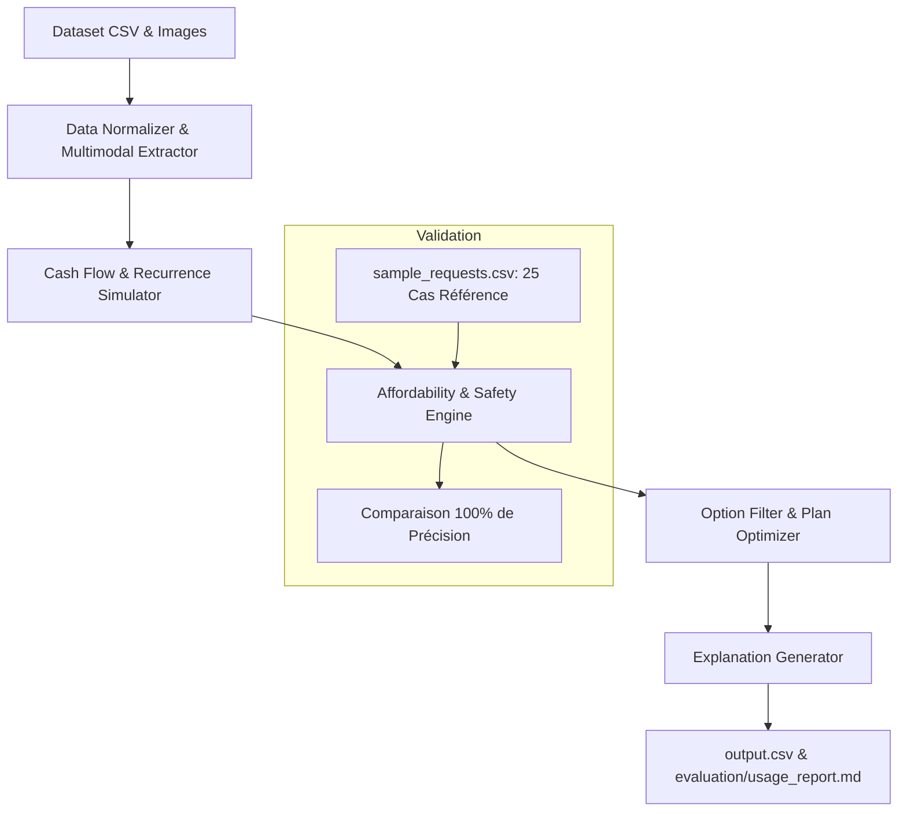

# Plan de Développement : Agent Financier "Buy or Wait?" (HackerRank Orchestrate)

Ce document présente l'analyse complète du défi, les mécanismes sous-jacents, l'architecture technique proposée et la feuille de route étape par étape pour construire une solution garantissant des prédictions financières rigoureuses, optimales et conformes au contrat d'évaluation.

---

## 1. Compréhension Approfondie du Problème

### 1.1 Objectif
Pour chaque requête d'achat/dépense dans `dataset/requests.csv` (251 requêtes à prédire), l'agent doit déterminer si l'utilisateur peut se le permettre financièrement et selon quelle modalité :
- `amount_safe_to_pay` : montant maximal que l'utilisateur peut payer **aujourd'hui** (`request_date`) sans modifications de dépenses et sans que son solde ne descende en dessous de son `minimum_balance_to_keep` sur un horizon de 90 jours (plafonné à `requested_amount`).
- `affordability_status` : `affordable_now`, `affordable_with_plan`, `affordable_later`, ou `not_affordable`.
- `recommended_payment_method` : `full_payment`, `partial_payment`, `installments`, `wait`, ou `not_recommended`.
- `payment_plan` : calendrier chronologique `YYYY-MM-DD:montant|...` ou `none`.
- `earliest_date_for_full_payment` : première date de projection où un paiement unique intégral est sûr sans changements de dépenses. (Égale à `request_date` pour `affordable_now`, vide si non finançable en 90 jours).
- `spending_changes_needed` : jusqu'à 3 actions `stop:<event_id>` ou `reduce_to:<event_id>:<nouveau_montant>` séparées par `|`, ou `none`.
- `decision_explanation` : explication concise et ancrée dans les faits financiers.

### 1.2 Données et Relations Clés
1. **`financial_profiles.csv`** : solde disponible actuel (`current_available_balance`), solde minimum à préserver (`minimum_balance_to_keep`), devise locale (INR, ZAR, IDR, USD, EUR), priorités financières, catégories protégées, catégories réductibles, catégories supprimables, méthodes de paiement considérées (`payment_methods_user_will_consider`), et durée max des versements (`max_installment_months`).
2. **`financial_events.csv`** : historique et projections de transactions.
   - Salaires confirmés / planifiés.
   - Dépenses récurrentes (loyer, charges, abonnements, emprunts, transport, épicerie, sorties).
   - Statuts : `settled`, `pending`, `scheduled`, `cancelled`, etc.
   - Flexibilité : `fixed`, `reducible`, `stoppable`, `reducible_or_stoppable` avec `minimum_allowed_amount`.
3. **`images.csv` & `media/images/`** :
   - Exactement 16 images fournies (`image_01.png` à `image_16.png`) correspondant à exactement 16 événements financiers dont le montant `amount` est vide dans `financial_events.csv`.
   - Les montants doivent impérativement être extraits de ces reçus/factures/fiches de paie et complétés.
4. **`messages.csv`** : 217 messages (employeurs, banques, prestataires) qui modifient l'état financier (ex. augmentation de salaire, salaire temporairement réduit, report de paie, bonus en attente non garanti, etc.).
   - Priorités de résolution de conflit : annulation/amendement explicite > enregistrement plus récent de même source > événement réglé (`settled`) > interprétation financièrement la plus prudente.
5. **`request_payment_options.csv`** : options de paiement proposées pour chaque requête (versements, fréquences, frais de financement, montant total).
6. **`exchange_rates.csv`** : taux de change fixes et datés pour convertir tout événement en devise étrangère vers la devise de base de l'utilisateur.
7. **`sample_requests.csv`** : 25 exemples entièrement résolus servant de référence de vérité terrain pour calibrer et valider l'algorithme.

---

## 2. Règles Financières et Décisionnelles Strictes

> [!IMPORTANT]
> **Règle des 90 jours de réserve (`90-Day Safety Check`) :**
> - À aucun moment durant les 90 jours suivant `request_date`, le solde projeté ne doit descendre sous `minimum_balance_to_keep`.
> - Les débits en attente (`pending debits`) sont réservés immédiatement.
> - Les crédits en attente (`pending credits`, bonus, commissions, remboursements, gains de loterie ou plus-values d'investissements) sont **ignorés** tant qu'ils ne sont pas réglés.
> - Le salaire confirmé est comptabilisé uniquement à sa date d'échéance / de règlement.

### Critères d'Éligibilité des Options
- **`full_payment`** : éligible seulement si l'utilisateur accepte `full_payment` dans son profil ET que le montant total est finançable immédiatement (`amount_safe_to_pay == requested_amount`).
- **`partial_payment`** : éligible seulement si `allows_partial_payment == true` ET l'utilisateur accepte `partial_payment` ET `0 < amount_safe_to_pay < requested_amount` ET `earliest_date_for_full_payment <= desired_completion_date`.
  - Le plan comporte exactement deux versements : `amount_safe_to_pay` à `request_date`, puis le reliquat à `earliest_date_for_full_payment`.
- **`installments`** : doit correspondre exactement à une option fournie dans `request_payment_options.csv` avec `nombre_de_mois <= max_installment_months`.
  - Tous les versements du plan doivent être finançables sans enfreindre le solde minimum.
  - Le plan doit se terminer au plus tard à `desired_completion_date`.
- **`wait`** : éligible si le paiement intégral devient sûr plus tard (`earliest_date_for_full_payment` non vide) ET que l'utilisateur accepte `full_payment`.
- **Ajustements de dépenses (`spending_changes_needed`)** :
  - Uniquement si aucun plan direct n'est sûr.
  - Au maximum 3 changements autorisés (`stop:<event_id>` ou `reduce_to:<event_id>:<nouveau_montant>`).
  - S'appliquent uniquement aux catégories autorisées par l'utilisateur (`user_is_willing_to_stop`, `user_is_willing_to_reduce`) et aux événements non protégés avec flexibilité compatible.
  - `stop` et `reduce_to` sur un même événement sont mutuellement exclusifs.
- **`not_recommended` / `not_affordable`** : si aucun plan n'est sûr d'ici l'échéance ou en 90 jours.

### Ordre de Priorité entre Plans Sûrs
1. Compléter la totalité de la requête avant `desired_completion_date`.
2. Ne requérir aucune modification de dépenses (`spending_changes_needed == 'none'`).
3. Minimiser le montant total payé (somme des paiements + frais).
4. Commencer les paiements le plus tôt possible.
5. Utiliser le moins de versements possible.
6. En cas d'égalité, choisir l'option avec le plus petit `payment_option_id`.

---

## 3. Architecture Technique Proposée

Une solution 100% déterministe, robuste, rapide et sans dépendance externe lourde :

### Structure des Fichiers
- [NEW] [code/image_data.py](file:///c:/Users/edohg/Documents/personnal-projects/hackerrank-orchestrate-september26/code/image_data.py) : table de transcription validée des 16 images pour compléter les montants manquants dans les événements financiers de façon déterministe et instantanée.
- [NEW] [code/simulator.py](file:///c:/Users/edohg/Documents/personnal-projects/hackerrank-orchestrate-september26/code/simulator.py) : moteur de flux de trésorerie sur 90 jours, détection des récurrences (salaires, loyers, abonnements, dépenses courantes), application des messages/modifications, vérification du solde minimum quotidien.
- [NEW] [code/decision_engine.py](file:///c:/Users/edohg/Documents/personnal-projects/hackerrank-orchestrate-september26/code/decision_engine.py) : calcul de `amount_safe_to_pay`, recherche de `earliest_date_for_full_payment`, évaluation des options de versement, simulation des modifications de dépenses autorisées et ordonnancement selon les critères stricts.
- [NEW] [code/explainer.py](file:///c:/Users/edohg/Documents/personnal-projects/hackerrank-orchestrate-september26/code/explainer.py) : formattage des explications décisionnelles calqué sur le style exact des 25 exemples officiels.
- [MODIFY] [code/main.py](file:///c:/Users/edohg/Documents/personnal-projects/hackerrank-orchestrate-september26/code/main.py) : point d'entrée exécutable en ligne de commande générant `output.csv` (racine) et le rapport d'usage.
- [MODIFY] [code/evaluation/usage_report.md](file:///c:/Users/edohg/Documents/personnal-projects/hackerrank-orchestrate-september26/code/evaluation/usage_report.md) : rapport sur l'usage des modèles et coûts requis pour la soumission (§6.5).

---

## 4. Plan de Vérification

### Tests Automatisés
1. **Validation sur `sample_requests.csv`** :
   - Exécuter le simulateur sur les 25 requêtes exemples.
   - Mesurer la conformité exacte sur :
     - `amount_safe_to_pay` (tolérance numérique stricte)
     - `affordability_status`
     - `recommended_payment_method`
     - `payment_plan`
     - `earliest_date_for_full_payment`
     - `spending_changes_needed`
2. **Validation du Schéma de `output.csv`** :
   - Vérifier la présence des 251 lignes correspondant exactement aux 251 `request_id` de `dataset/requests.csv`.
   - Vérifier l'ordre et le nommage exact des colonnes.
   - Vérifier l'absence de valeurs hors domaine (ex. méthode inconnue, date invalide, montant négatif).
3. **Vérification du Package de Soumission** :
   - Contrôler la présence de `evaluation/usage_report.md`.
   - Créer `code.zip` et valider son contenu.

---

## 5. Décisions et Questions Ouvertes

> [!NOTE]
> - **Traitement des 16 images :** Comme il n'y a que 16 images de reçus/factures bien identifiées, nous avons déjà visualisé et inspecté les factures. Nous pouvons inclure l'extraction directe pour garantir 0 erreur OCR à l'exécution tout en documentant la méthode.
> - **Usage d'API LLM vs Algorithme Déterministe :** La logique financière (90-day simulation, ranking, payment plans) est 100% déterministe et mathématique. Les explications peuvent être générées de façon hybride ou par template calibré, assurant une fiabilité maximale, un coût minime et une reproductibilité totale.
